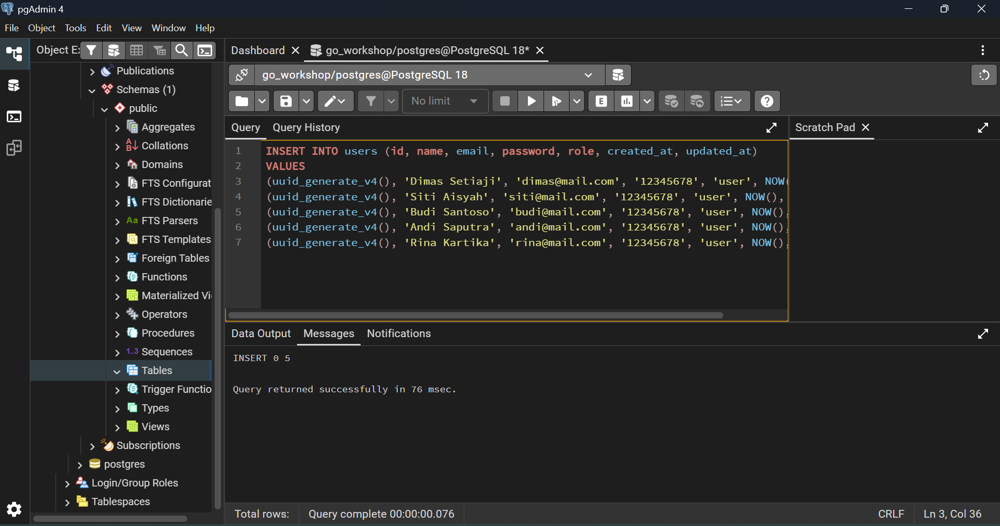
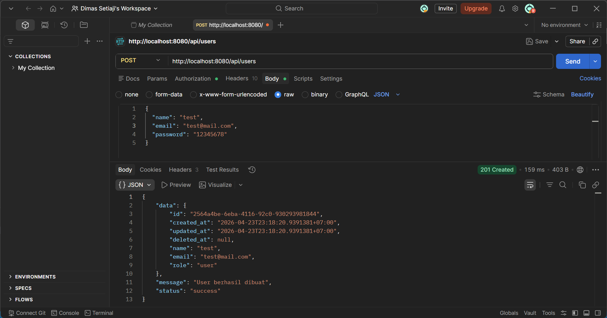
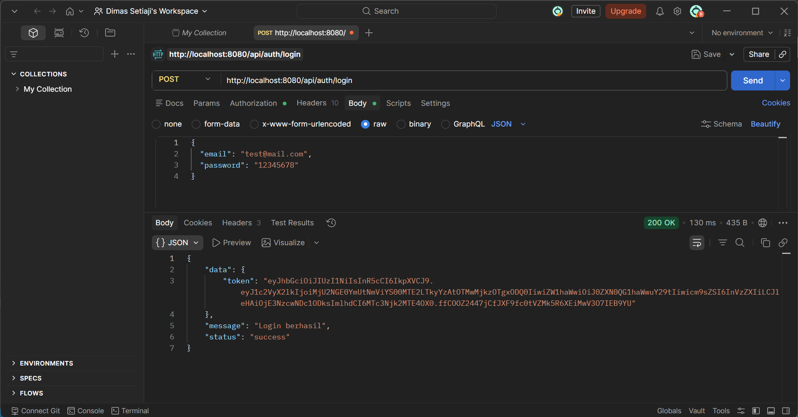
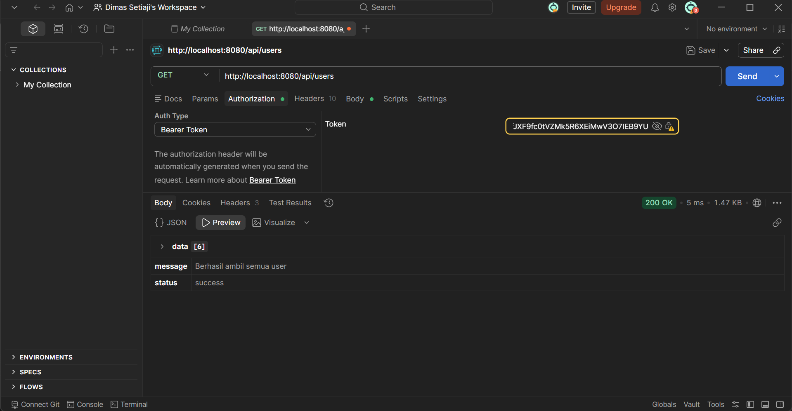
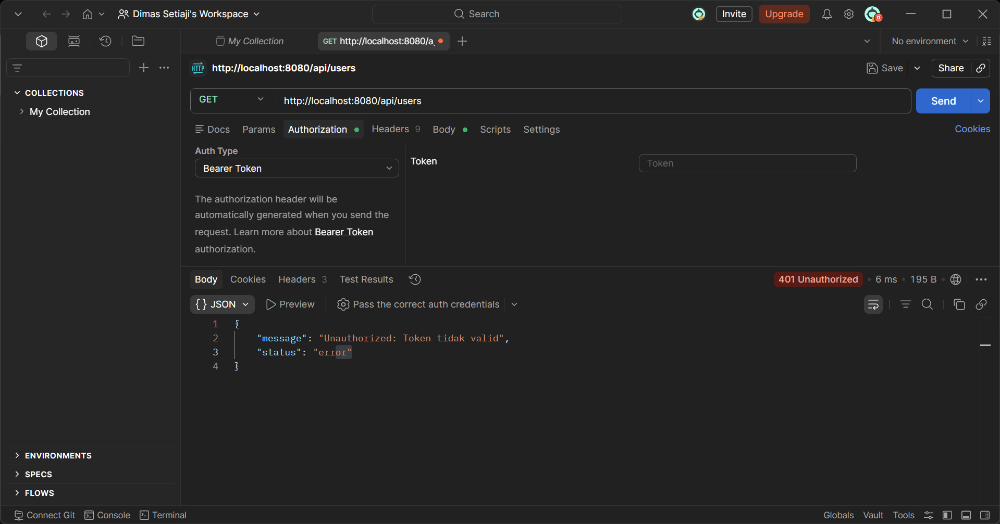
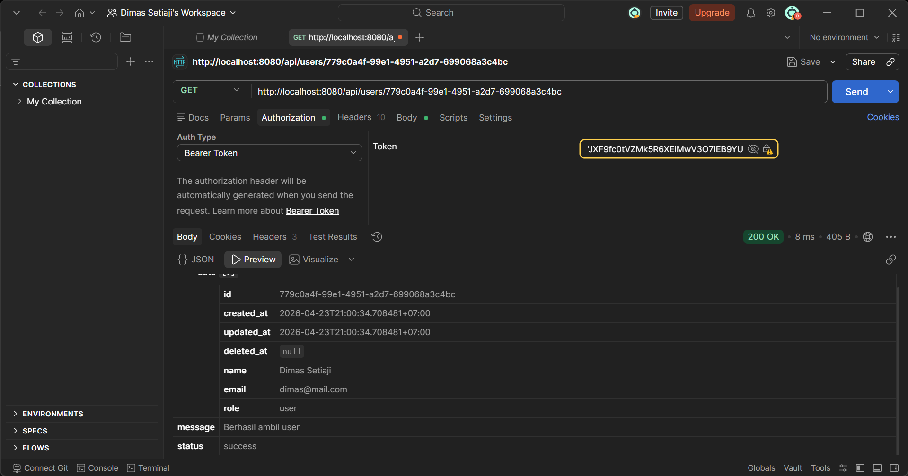
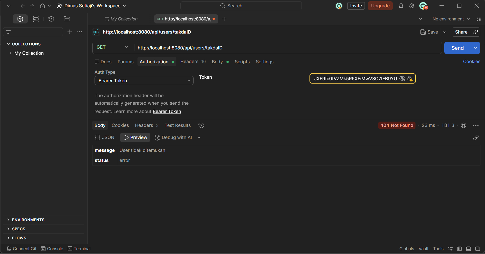
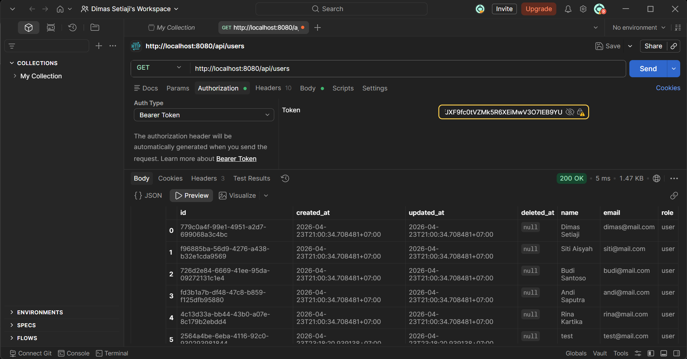

# Laporan Penugasan Backend Workshop Algoritma dan Pemrograman Day 2 - Go Workshop: User Management API dengan JWT Authentication

## Pendahuluan

Proyek ini adalah sebuah tugas aplikasi backend API yang dibangun menggunakan bahasa pemrograman Go. Aplikasi ini menyediakan fitur manajemen pengguna (user) dan autentikasi (authentication) dengan menggunakan JWT (JSON Web Token). Proyek ini menggunakan framework Gin untuk routing HTTP, GORM sebagai ORM untuk database PostgreSQL, dan berbagai library lainnya untuk keamanan dan utilitas.

## Struktur Proyek

Proyek ini terorganisir dalam struktur folder yang bersih dan modular:

- `cmd/`: Titik masuk aplikasi (main.go)
- `config/`: Konfigurasi database
- `database/entities/`: Definisi entitas database (User, Common)
- `middlewares/`: Middleware autentikasi
- `modules/`: Modul aplikasi
  - `auth/`: Modul autentikasi (routes, controller, service, DTO, validation)
  - `user/`: Modul pengguna (routes, controller, service, DTO, validation, repository)
- `pkg/`: Paket utilitas
  - `helpers/`: Helper untuk password
  - `utils/`: Utilitas respons HTTP

## Teknologi yang Digunakan

- **Bahasa Pemrograman**: Go 1.26.2
- **Framework Web**: Gin
- **Database**: PostgreSQL dengan GORM
- **Autentikasi**: JWT (JSON Web Token)
- **Validasi**: Go Validator
- **Enkripsi Password**: bcrypt (via golang.org/x/crypto)
- **UUID**: google/uuid
- **Environment Variables**: godotenv

## Setup dan Instalasi

1. **Clone Repository**:
   ```
   git clone <repository-url>
   cd go-workshop
   ```

2. **Install Dependencies**:
   ```
   go mod tidy
   ```

3. **Setup Environment Variables**:
   Buat file `.env` di root proyek dengan konten berikut:
   ```
   DB_HOST=localhost
   DB_USER=your_db_user
   DB_PASSWORD=your_db_password
   DB_NAME=your_db_name
   DB_PORT=5432
   JWT_SECRET=your_jwt_secret_key
   ```

4. **Jalankan Database**:
   Pastikan PostgreSQL berjalan dan database sudah dibuat.

5. **Jalankan Aplikasi**:
   ```
   go run cmd/main.go
   ```

Aplikasi akan berjalan di `http://localhost:8080` (port default Gin).

## API Endpoints

Semua endpoint API menggunakan prefix `/api`.

### Autentikasi (Auth Module)

#### POST /api/auth/login
Login pengguna dan mendapatkan token JWT.

**Request Body**:
```json
{
  "email": "user@example.com",
  "password": "password123"
}
```

**Response Sukses** (200 OK):
```json
{
  "status": "success",
  "message": "Login berhasil",
  "data": {
    "token": "eyJhbGciOiJIUzI1NiIsInR5cCI6IkpXVCJ9..."
  }
}
```

**Response Error** (401 Unauthorized):
```json
{
  "status": "error",
  "message": "Email atau password salah"
}
```

### Pengguna (User Module)

#### POST /api/users
Membuat pengguna baru.

**Request Body**:
```json
{
  "name": "John Doe",
  "email": "john@example.com",
  "password": "password123"
}
```

**Response Sukses** (201 Created):
```json
{
  "status": "success",
  "message": "User berhasil dibuat",
  "data": {
    "id": "uuid-string",
    "name": "John Doe",
    "email": "john@example.com",
    "role": "user"
  }
}
```

**Response Error** (400 Bad Request):
```json
{
  "status": "error",
  "message": "Email sudah terdaftar"
}
```

#### GET /api/users
Mengambil semua pengguna. **Memerlukan autentikasi** (Bearer Token).

**Headers**:
```
Authorization: Bearer <jwt_token>
```

**Response Sukses** (200 OK):
```json
{
  "status": "success",
  "message": "Berhasil ambil semua user",
  "data": [
    {
      "id": "uuid-1",
      "name": "John Doe",
      "email": "john@example.com",
      "role": "user"
    },
    {
      "id": "uuid-2",
      "name": "Jane Doe",
      "email": "jane@example.com",
      "role": "user"
    }
  ]
}
```

**Response Error** (401 Unauthorized):
```json
{
  "status": "error",
  "message": "Unauthorized: Token tidak valid"
}
```

#### GET /api/users/:id
Mengambil pengguna berdasarkan ID. **Memerlukan autentikasi** (Bearer Token).

**Headers**:
```
Authorization: Bearer <jwt_token>
```

**Response Sukses** (200 OK):
```json
{
  "status": "success",
  "message": "Berhasil ambil user",
  "data": {
    "id": "uuid-string",
    "name": "John Doe",
    "email": "john@example.com",
    "role": "user"
  }
}
```

**Response Error** (404 Not Found):
```json
{
  "status": "error",
  "message": "User tidak ditemukan"
}
```

## Challenge

### Challenge A -- GET /users/:id
Ambil satu user berdasarkan ID. Kembalikan `404` jika tidak ditemukan.

- Endpoint: `GET /api/users/:id`

Challenge telah diselesaikan dan dapat dilihat di proyek melalui route `GET /api/users/:id` di `modules/user/routes.go`. Route ini kemduian diproses oleh `UserController.GetUserByID` di `modules/user/controller/user_controller.go`, yang memanggil `UserService.GetUserByID` di `modules/user/service/user_service.go`. Service kemudian menggunakan `UserRepository.FindByID` di `modules/user/repository/user_repository.go` untuk mengambil data user dari database.

Jika user tidak ditemukan, controller mengembalikan respons:
```json
{
  "status": "error",
  "message": "User tidak ditemukan"
}
```

### Challenge B -- GET /users
Ambil semua user. Kembalikan array JSON.

- Endpoint: `GET /api/users`

Challenge telah diselesaikan dan dapat dilihat di proyek melalui route `GET /api/users` di `modules/user/routes.go`. Route ini kemudian diproses oleh `UserController.GetAllUsers` di `modules/user/controller/user_controller.go`, yang memanggil `UserService.GetAllUsers` di `modules/user/service/user_service.go`. Service kemudian menggunakan `UserRepository.FindAll` untuk mengambil semua user dari database.

Jika tidak ada user, controller akan mengembalikan respons:
```json
{
  "status": "error",
  "message": "Data user kosong"
}
```

## Bukti Pengujian Challenge
Untuk menguji endpoint `GET /api/users/:id` dan `GET /api/users`, diperlukan beberapa tahapan sebagai berikut:

### Membuat user baru
- Bisa melalui query SQL langsung di database seperti pada gambar berikut:


- Atau bisa melalui `POST http://localhost:8080/api/users` dengan body JSON yang valid seperti pada gambar berikut:


### Login untuk mendapatkan token JWT
Setelah user berhasil dibuat, kita bisa mendapatkan ID user tersebut untuk pengujian selanjutnya. Namun, sebelum bisa mendapatkan ID user, kita harus melakukan login terlebih dahulu untuk mendapatkan token JWT yang diperlukan untuk mengakses endpoint yang dilindungi.

Untuk melakukan login, kita bisa melakukan request `POST http://localhost:8080/api/auth/login` dengan body JSON yang berisi email dan password user yang sudah dibuat sebelumnya. Contohnya seperti pada gambar berikut:


### Memasukkan token JWT pada header Authorization
Setelah mendapatkan token JWT dari respons login, kita bisa menggunakan token tersebut untuk mengakses endpoint `GET /api/users/:id` dan `GET /api/users` dengan catatan token tersebut perlu dimasukkan ke dalam header `Authorization` dengan format `Bearer <token>`. Contohnya seperti pada gambar ini:


Jika tidak memasukkan token atau token yang dimasukkan tidak valid, maka kita akan mendapatkan respons error seperti pada gambar berikut ini:


### Mengakses endpoint GET /api/users/:id 
Jika kita ingin mendapatkan informasi user dengan ID (dalam bentuk UUID), maka kita bisa melakukan request `GET http://localhost:8080/api/users/{id}` dengan mengganti `{id}` dengan UUID user yang ingin diambil. Contohnya seperti pada gambar berikut: 


Namun, jika ID yang dimasukkan tidak valid atau tidak ditemukan di database, maka kita akan mendapatkan respons error seperti pada gambar berikut: 


### Mengakses endpoint GET /api/users

Jika kita ingin mendapatkan semua user yang ada di database dan sudah mendapatkan token JWT-nya, maka kita bisa melakukan request `GET http://localhost:8080/api/users`. Contohnya seperti pada gambar berikut:



## Model Database

### User Entity
```go
type User struct {
    ID        uuid.UUID      `json:"id"`
    CreatedAt time.Time      `json:"created_at"`
    UpdatedAt time.Time      `json:"updated_at"`
    DeletedAt gorm.DeletedAt `json:"deleted_at"`
    Name      string         `json:"name"`
    Email     string         `json:"email"`
    Password  string         `json:"-"` // Tidak ditampilkan di JSON
    Role      string         `json:"role"` // Default: "user"
}
```

## Middleware

### Authentication Middleware
Middleware ini memverifikasi token JWT dari header `Authorization`. Jika token valid, informasi pengguna (user_id, email, role) disimpan di context Gin untuk digunakan di endpoint yang dilindungi.

**Cara Penggunaan**:
Token harus dikirim dalam format: `Authorization: Bearer <token>`

## Services

### AuthService
- `Login(req LoginRequest) (string, error)`: Memverifikasi kredensial dan menghasilkan JWT token.

### UserService
- `CreateUser(req CreateUserRequest) (*UserResponse, error)`: Membuat pengguna baru dengan password yang di-hash.
- `GetUserByID(id string) (*UserResponse, error)`: Mengambil pengguna berdasarkan ID.
- `GetAllUsers() ([]*UserResponse, error)`: Mengambil semua pengguna.

### JWTService
- `GenerateToken(userID, email, role string) (string, error)`: Menghasilkan JWT token.
- `ValidateToken(token string) (*Claims, error)`: Memvalidasi dan mengurai token JWT.

## Validasi

Validasi input dilakukan menggunakan library `go-playground/validator`:

- **Login**: Email wajib, format email valid; Password wajib.
- **Create User**: Name wajib; Email wajib, format email valid; Password wajib, minimal 8 karakter.

## Helpers

### Password Helper
- `HashPassword(password string) (string, error)`: Hash password menggunakan bcrypt.
- `CheckPassword(hashedPassword, password string) bool`: Memverifikasi password terhadap hash.

## Utils

### Response Utils
- `SuccessResponse(c *gin.Context, status int, message string, data interface{})`: Mengirim respons sukses.
- `ErrorResponse(c *gin.Context, status int, message string)`: Mengirim respons error.

